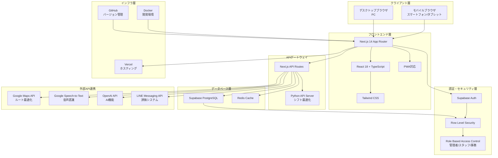
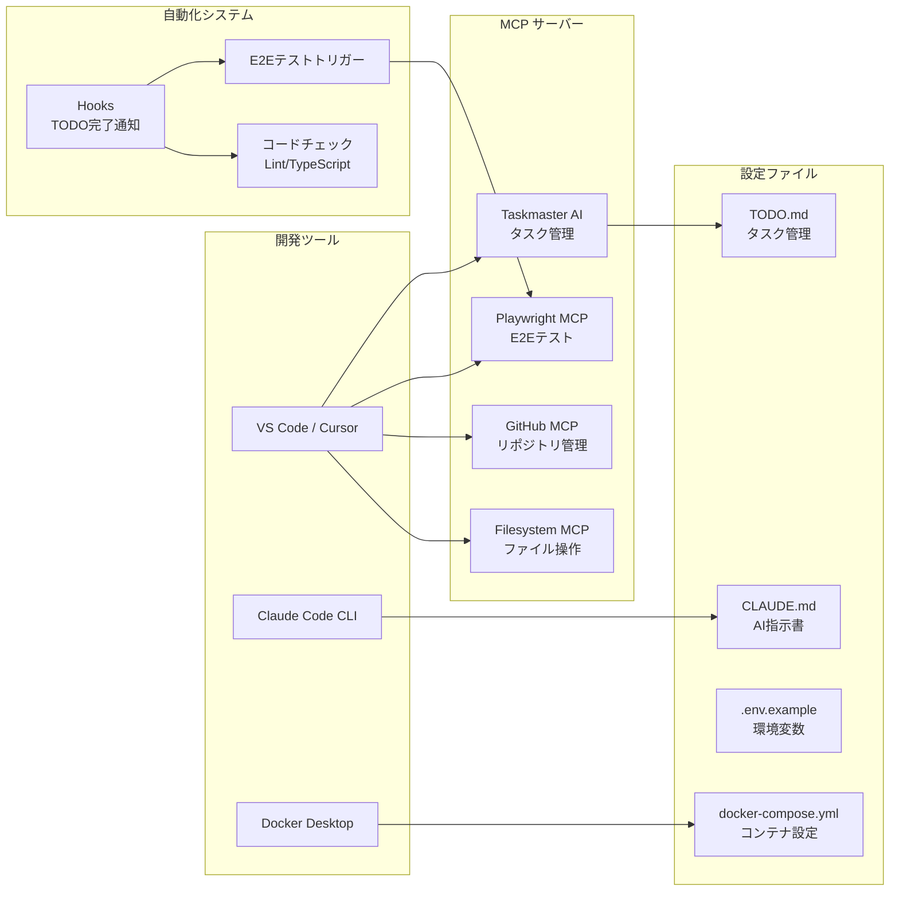
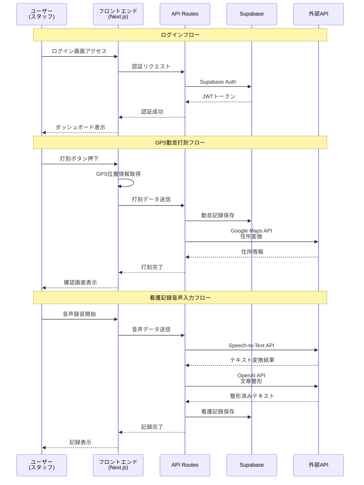
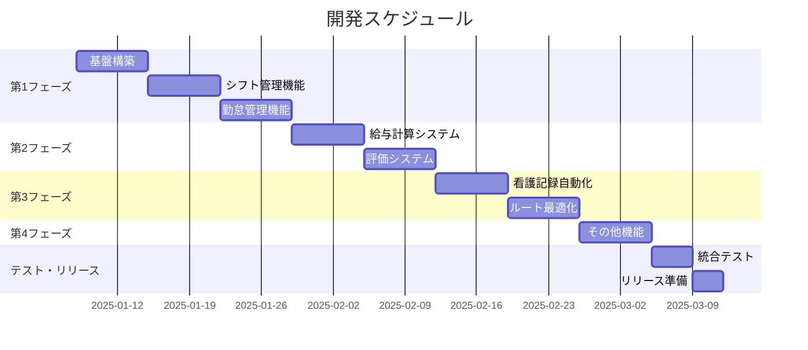
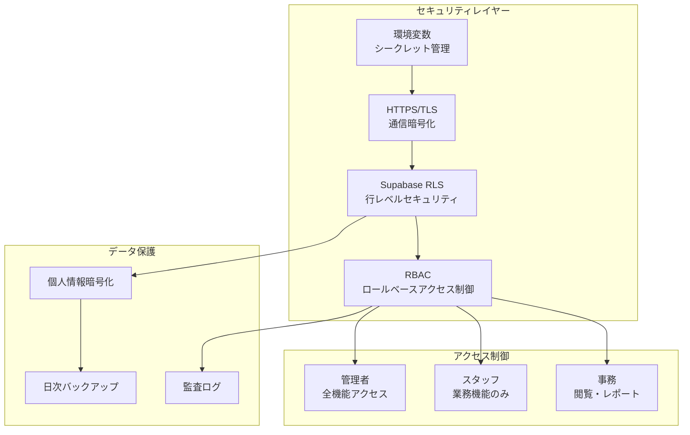
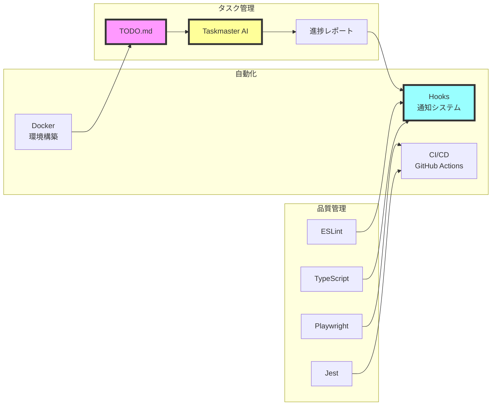

# 訪問看護事業支援システム - アーキテクチャ図

## システム全体構成

```mermaid
graph TB
    subgraph "クライアント層"
        A[モバイルブラウザ<br/>スマートフォン/タブレット]
        B[デスクトップブラウザ<br/>PC]
    end

    subgraph "フロントエンド層"
        C[Next.js 14 App Router]
        D[React 18 + TypeScript]
        E[Tailwind CSS]
        F[PWA対応]
    end

    subgraph "認証・セキュリティ層"
        G[Supabase Auth]
        H[Row Level Security]
        I[Role Based Access Control<br/>管理者/スタッフ/事務]
    end

    subgraph "APIゲートウェイ"
        J[Next.js API Routes]
        K[Python API Server<br/>シフト最適化]
    end

    subgraph "データベース層"
        L[Supabase PostgreSQL]
        M[Redis Cache]
    end

    subgraph "外部API連携"
        N[Google Maps API<br/>ルート最適化]
        O[Google Speech-to-Text<br/>音声認識]
        P[OpenAI API<br/>AI機能]
        Q[LINE Messaging API<br/>評価システム]
    end

    subgraph "インフラ層"
        R[Vercel<br/>ホスティング]
        S[Docker<br/>開発環境]
        T[GitHub<br/>バージョン管理]
    end

    A --> C
    B --> C
    C --> D
    D --> E
    C --> F
    C --> G
    G --> H
    H --> I
    C --> J
    J --> K
    J --> L
    J --> M
    J --> N
    J --> O
    J --> P
    J --> Q
    L --> H
    C --> R
    S --> C
    T --> C
```

## 開発環境構成

```mermaid
graph LR
    subgraph "開発ツール"
        A1[VS Code / Cursor]
        A2[Claude Code CLI]
        A3[Docker Desktop]
    end

    subgraph "MCP サーバー"
        B1[Taskmaster AI<br/>タスク管理]
        B2[Playwright MCP<br/>E2Eテスト]
        B3[GitHub MCP<br/>リポジトリ管理]
        B4[Filesystem MCP<br/>ファイル操作]
    end

    subgraph "自動化システム"
        C1[Hooks<br/>TODO完了通知]
        C2[E2Eテストトリガー]
        C3[コードチェック<br/>Lint/TypeScript]
    end

    subgraph "設定ファイル"
        D1[CLAUDE.md<br/>AI指示書]
        D2[TODO.md<br/>タスク管理]
        D3[.env.example<br/>環境変数]
        D4[docker-compose.yml<br/>コンテナ設定]
    end

    A1 --> B1
    A1 --> B2
    A1 --> B3
    A1 --> B4
    A2 --> D1
    A3 --> D4
    B1 --> D2
    C1 --> C2
    C2 --> B2
    C1 --> C3
```

## データフロー図

```mermaid
sequenceDiagram
    participant U as ユーザー<br/>(スタッフ)
    participant F as フロントエンド<br/>(Next.js)
    participant A as API Routes
    participant S as Supabase
    participant E as 外部API

    Note over U,E: ログインフロー
    U->>F: ログイン画面アクセス
    F->>A: 認証リクエスト
    A->>S: Supabase Auth
    S-->>A: JWTトークン
    A-->>F: 認証成功
    F-->>U: ダッシュボード表示

    Note over U,E: GPS勤怠打刻フロー
    U->>F: 打刻ボタン押下
    F->>F: GPS位置情報取得
    F->>A: 打刻データ送信
    A->>S: 勤怠記録保存
    A->>E: Google Maps API<br/>住所変換
    E-->>A: 住所情報
    A-->>F: 打刻完了
    F-->>U: 確認画面表示

    Note over U,E: 看護記録音声入力フロー
    U->>F: 音声録音開始
    F->>A: 音声データ送信
    A->>E: Speech-to-Text API
    E-->>A: テキスト変換結果
    A->>E: OpenAI API<br/>文章整形
    E-->>A: 整形済みテキスト
    A->>S: 看護記録保存
    A-->>F: 記録完了
    F-->>U: 記録表示
```

## フェーズ別実装計画

```mermaid
gantt
    title 開発スケジュール
    dateFormat YYYY-MM-DD
    section 第1フェーズ
    基盤構築           :2025-01-08, 7d
    シフト管理機能     :7d
    勤怠管理機能       :7d
    
    section 第2フェーズ
    給与計算システム   :7d
    評価システム       :7d
    
    section 第3フェーズ
    看護記録自動化     :7d
    ルート最適化       :7d
    
    section 第4フェーズ
    その他機能         :7d
    
    section テスト・リリース
    統合テスト         :4d
    リリース準備       :3d
```

## セキュリティアーキテクチャ

```mermaid
graph TB
    subgraph "セキュリティレイヤー"
        A[HTTPS/TLS<br/>通信暗号化]
        B[Supabase RLS<br/>行レベルセキュリティ]
        C[RBAC<br/>ロールベースアクセス制御]
        D[環境変数<br/>シークレット管理]
    end

    subgraph "データ保護"
        E[個人情報暗号化]
        F[日次バックアップ]
        G[監査ログ]
    end

    subgraph "アクセス制御"
        H[管理者<br/>全機能アクセス]
        I[スタッフ<br/>業務機能のみ]
        J[事務<br/>閲覧・レポート]
    end

    A --> B
    B --> C
    C --> H
    C --> I
    C --> J
    B --> E
    E --> F
    C --> G
    D --> A
```

## 開発支援ツール連携

```mermaid
graph LR
    subgraph "タスク管理"
        A[TODO.md]
        B[Taskmaster AI]
        C[進捗レポート]
    end

    subgraph "品質管理"
        D[ESLint]
        E[TypeScript]
        F[Playwright]
        G[Jest]
    end

    subgraph "自動化"
        H[Hooks<br/>通知システム]
        I[CI/CD<br/>GitHub Actions]
        J[Docker<br/>環境構築]
    end

    A --> B
    B --> C
    C --> H
    D --> H
    E --> H
    F --> I
    G --> I
    J --> A

    style A fill:#f9f,stroke:#333,stroke-width:4px
    style B fill:#ff9,stroke:#333,stroke-width:4px
    style H fill:#9ff,stroke:#333,stroke-width:4px
```

---

このアーキテクチャ図は、プロジェクトの技術スタック、データフロー、開発環境、セキュリティ構成を視覚的に表現しています。