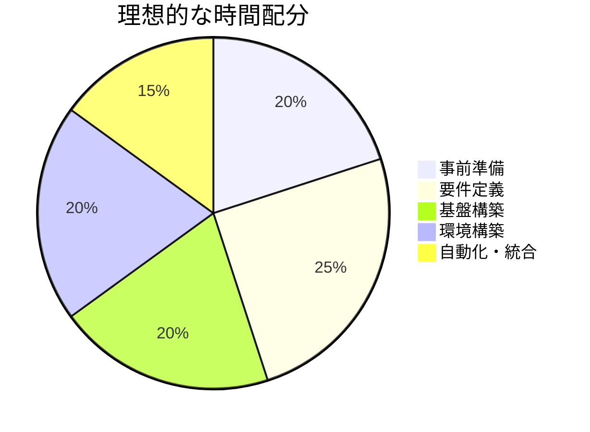

# 理想的なプロジェクトセットアップフロー

## 現在の手順の問題点

1. **要件定義前の環境構築** - Dockerを先に作ってしまった
2. **ファイル名問題の後対応** - 最初から英語ファイル名にすべきだった
3. **MCP設定の試行錯誤** - context7の仕様を先に確認すべきだった
4. **自動化の後付け** - 最初から組み込むべきだった

## 理想的なセットアップフロー

```mermaid
flowchart TD
    Start([プロジェクト開始]) --> A[事前準備]
    
    subgraph "Phase 0: 事前準備"
        A --> A1[プロジェクトテンプレート選択]
        A1 --> A2[命名規則の決定<br/>・英語ファイル名<br/>・kebab-case]
        A2 --> A3[ツールチェーンの確認<br/>・Claude Code<br/>・VS Code/Cursor<br/>・必要なMCP]
    end
    
    A3 --> B[要件分析]
    
    subgraph "Phase 1: 要件定義"
        B --> B1[ビジネス要件の整理]
        B1 --> B2[技術要件の決定]
        B2 --> B3[制約事項の確認]
        B3 --> B4[フェーズ分けとマイルストーン]
    end
    
    B4 --> C[プロジェクト初期化]
    
    subgraph "Phase 2: 基盤構築"
        C --> C1[GitHubリポジトリ作成<br/>+テンプレート適用]
        C1 --> C2[基本ファイル作成<br/>・README.md<br/>・.gitignore<br/>・LICENSE]
        C2 --> C3[開発ガイドライン作成<br/>・CLAUDE.md<br/>・CONTRIBUTING.md]
        C3 --> C4[タスク管理設定<br/>・TODO.md<br/>・Taskmaster AI]
    end
    
    C4 --> D[開発環境]
    
    subgraph "Phase 3: 環境構築"
        D --> D1[package.json作成<br/>依存関係定義]
        D1 --> D2[環境変数設計<br/>.env.example]
        D2 --> D3[Docker環境構築<br/>dev/prod分離]
        D3 --> D4[IDE設定<br/>・.vscode/<br/>・.cursor/]
    end
    
    D4 --> E[自動化]
    
    subgraph "Phase 4: 自動化設定"
        E --> E1[Git hooks設定]
        E1 --> E2[CI/CD設定<br/>GitHub Actions]
        E2 --> E3[品質チェック設定<br/>・ESLint<br/>・Prettier<br/>・TypeScript]
        E3 --> E4[テスト環境設定<br/>・Jest<br/>・Playwright]
    end
    
    E4 --> F[統合]
    
    subgraph "Phase 5: ツール統合"
        F --> F1[MCP設定<br/>計画的に選定]
        F1 --> F2[Claude hooks設定]
        F2 --> F3[通知・監視設定]
        F3 --> F4[ドキュメント生成]
    end
    
    F4 --> End([開発開始準備完了])
    
    style Start fill:#e1f5e1
    style End fill:#ffe1e1
    style A fill:#f0f8ff
    style B fill:#fff0f8
    style C fill:#f8fff0
    style D fill:#f0fff8
    style E fill:#fff8f0
    style F fill:#f8f0ff
```



## ベストプラクティスチェックリスト

### 🎯 Phase 0: 事前準備（最重要）
- [ ] プロジェクトの種類に応じたテンプレート選択
- [ ] 命名規則の統一（英語、kebab-case）
- [ ] 使用するツール・サービスのリストアップ
- [ ] チーム規模と役割分担の明確化

### 📋 Phase 1: 要件定義
- [ ] ビジネス要件の文書化
- [ ] 技術スタックの決定と根拠
- [ ] 制約事項（予算、期限、技術）の明確化
- [ ] フェーズ分けとマイルストーン設定

### 🏗️ Phase 2: 基盤構築
- [ ] GitHubリポジトリ（適切なテンプレート使用）
- [ ] 基本的なプロジェクト構造
- [ ] 開発ガイドライン（CLAUDE.md）
- [ ] タスク管理システムの初期設定

### 🛠️ Phase 3: 環境構築
- [ ] package.jsonの完全な定義
- [ ] 環境変数の設計と文書化
- [ ] Docker環境（開発/本番の分離）
- [ ] IDE設定の共有

### 🤖 Phase 4: 自動化設定
- [ ] コミット前チェック（husky）
- [ ] CI/CDパイプライン
- [ ] コード品質の自動チェック
- [ ] テストの自動実行

### 🔧 Phase 5: ツール統合
- [ ] 必要なMCPの計画的導入
- [ ] Claude/Cursor用の設定
- [ ] 監視・通知システム
- [ ] ドキュメント自動生成

## 時間配分の目安



## 今回のプロジェクトで学んだ教訓

### ❌ 避けるべきこと
1. **要件が不明確なまま環境構築を始める**
   - Dockerを先に作ってしまった
   - 後から要件に合わせて修正が必要に

2. **日本語ファイル名の使用**
   - Gitやエディタで文字化け問題
   - 最初から英語で統一すべき

3. **場当たり的なツール導入**
   - MCPを試行錯誤で追加
   - 事前に必要なツールを計画すべき

### ✅ 推奨アプローチ
1. **テンプレートの活用**
   ```bash
   # Next.jsプロジェクトの場合
   npx create-next-app@latest my-app --typescript --tailwind --app
   ```

2. **設定ファイルの初期準備**
   ```json
   // .claude/project-config.json
   {
     "naming": "kebab-case",
     "language": "en",
     "aiTools": ["taskmaster", "playwright"],
     "automate": true
   }
   ```

3. **スクリプトの事前準備**
   ```bash
   # setup.sh
   #!/bin/bash
   npm install
   cp .env.example .env.local
   docker-compose up -d
   npm run db:migrate
   ```

## 結論

理想的なプロジェクトセットアップは：
1. **計画に時間をかける**（全体の45%）
2. **標準化されたテンプレートを使う**
3. **自動化を最初から組み込む**
4. **ドキュメントファーストで進める**

これにより、後戻りや修正作業を最小限に抑え、効率的な開発が可能になります。