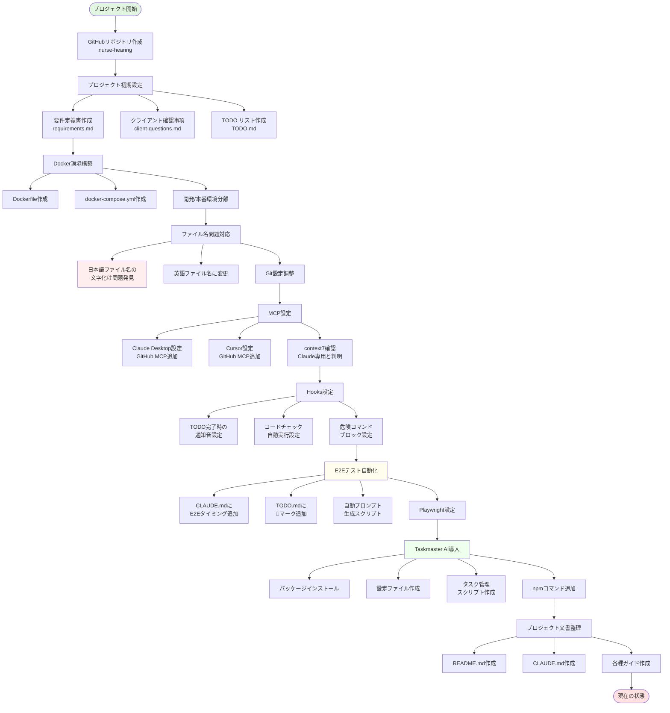
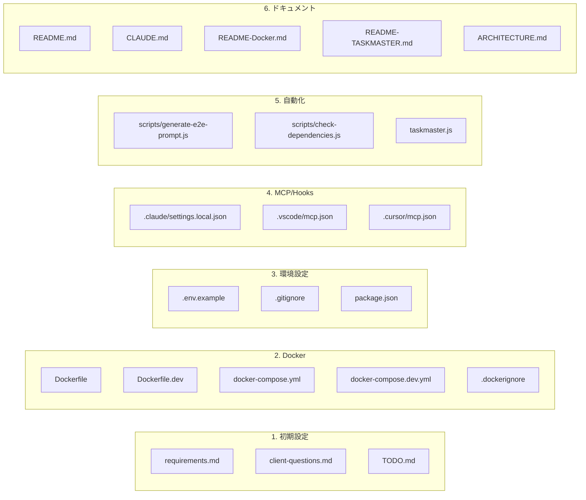
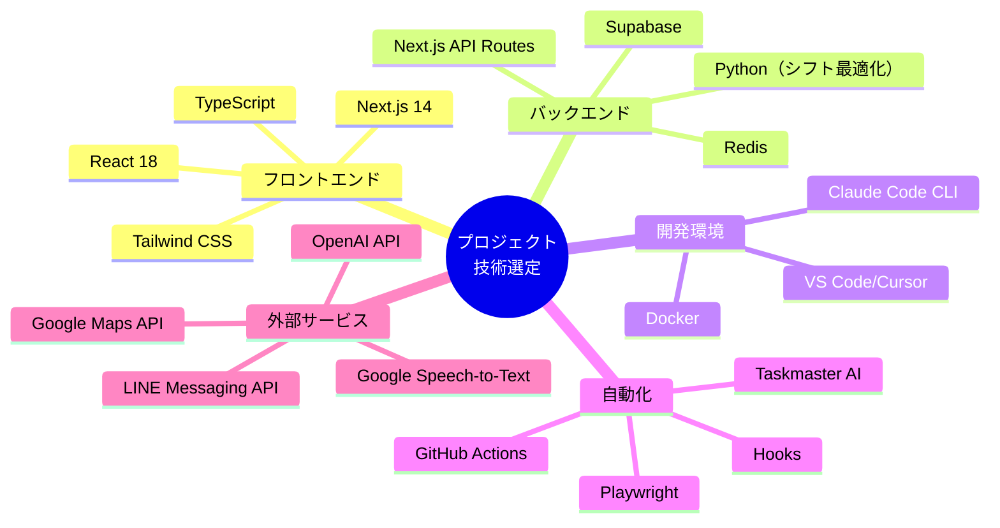

# プロジェクトセットアップフロー図

## あなたが実行してきた作業の流れ

## 各ステップで作成されたファイル

## 技術的な決定事項

## セットアップの成果

1. **プロジェクト基盤** ✅
   - GitHubリポジトリ
   - 要件定義
   - タスク管理システム

2. **開発環境** ✅
   - Docker環境
   - MCP統合
   - 自動化ツール

3. **品質保証** ✅
   - E2Eテスト自動化
   - コードチェック
   - セキュリティ設定

4. **効率化** ✅
   - Taskmaster AI
   - Hooks通知
   - 自動プロンプト生成

現在、開発を開始する準備が完全に整っています。